# QR Code API  <!-- omit in toc -->

This document describes methods, parameters and usage of Fast QR Code Generator API

## Table of Contents <!-- omit in toc -->
- [API usage methods](#api-usage-methods)
  - [Simple QR Code generation](#simple-qr-code-generation)
  - [QR Code generation with image upload](#qr-code-generation-with-image-upload)
  - [QR Code generation with separately uploaded image](#qr-code-generation-with-separately-uploaded-image)
- [API parameters](#api-parameters)
  - [Basic parameters](#basic-parameters)
  - [Appearance parameters](#appearance-parameters)
  - [QR Code specific parameters](#qr-code-specific-parameters)
- [Styles' list](#styles-list)
- [Eyes styles' list](#eyes-styles-list)

## API usage methods

This API offers three similar workflows for QR Code generation. All of those differs in the way of handling image which may be embedded into QR.   

### Simple QR Code generation
The basic scheme of usage is based on `/generateQR` API endpoint. All parameters listed below are available. For `image` parameter expected value is (encoded) URL of image which should be embedded in QR Code. Endpoint is accesible via HTTP GET method. Only valid URLs pointing to `*.svg`, `*.jpeg`, `*.jpg`, `*.png` and `*.gif` files are allowed.

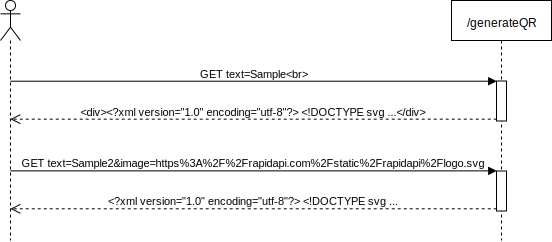

### QR Code generation with image upload
If custom image should be placed on QR and it is not accesible via external URL, it can be uploaded in the same POST request to `/generateQRwithLogo` endpoint. As far as big overhead is caused by usage of multipart method, it is not recommended to use this method for multiple codes generation with the same image, but it is the best solution for single QR generation with custom image. All parameters listed in the tables below are also available. For upload, `*.svg`, `*.jpeg`, `*.jpg`, `*.png` and `*.gif` files are allowed.

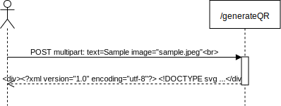

### QR Code generation with separately uploaded image
If custom image will be used for batch generation of QRs, this image can be previously uploaded via `/uploadLogo` endpoint. Every uploaded image will be available for 24 hours after last request involving this image. `/uploadLogo` endpoint responses with filename which can be used for future request to `/generateQR` endpoint with this filename specifed as value of `image` parameter. This workflow is recommended for batch generation of QRs or dynamic generation as it guarantees lowest possible response time and data overhead. For upload, `*.svg`, `*.jpeg`, `*.jpg`, `*.png` and `*.gif` files are allowed.

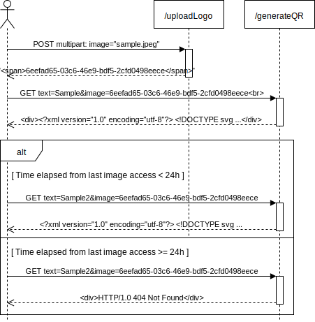

## API parameters

### Basic parameters
| Parameter | Type             | Default value           | Accepted values                 | Description                                                                                                                                                                                                                                                                                                   |
| --------- | ---------------- | ----------------------- | ------------------------------- | ------------------------------------------------------------------------------------------------------------------------------------------------------------------------------------------------------------------------------------------------------------------------------------------------------------- |
| text      | `string`         | **required in request** | `string` of (almost) any length | Text which will be encoded in QR. Value have to be URL encoded. Maximum length which can be encoded in QR as UTF-8 with the lowest error correction level is 2953 bytes, resulting in 177x177 modules code. For more information please refer to: [QRcode.com](https://www.qrcode.com/en/about/version.html). |
| size      | (`float`\|`int`) | 150                     | <100;2500>                      | Default size (width and height) in pixels for generated image of QR Code. If requested value is `float` it will be casted to nearest `int`.                                                                                                                                                                   |
| format    | `string`         | `svg`                   | {`svg`, `png`, `pdf`, `jpg`}    | File format for generated QR.                                                                                                                                                                                                                                                                                 |

### Appearance parameters
| Parameter                                             | Type               | Default value | Accepted values                                 | Description                                                                                                                                                                                                                                                                                                                                                                                                                                                                                                          |
| ----------------------------------------------------- | ------------------ | ------------- | ----------------------------------------------- | -------------------------------------------------------------------------------------------------------------------------------------------------------------------------------------------------------------------------------------------------------------------------------------------------------------------------------------------------------------------------------------------------------------------------------------------------------------------------------------------------------------------- |
| style                                                 | `string`           | `default`     | **see [Styles' list](#styles-list)**            | Style applied to QR Code modules. Please refer to table below where all available styles are listed.                                                                                                                                                                                                                                                                                                                                                                                                                 |
| <a name="style_color">style_color</a>                 | `string`           | `#000000`     | <`#000000`; `#FFFFFF`>                          | Base color for QR Code modules referred as RGB triple value presented as hex number. Can be obtained from [w3schools.com](https://www.w3schools.com/colors/colors_picker.asp).                                                                                                                                                                                                                                                                                                                                       |
| inner_eye_style                                       | `string`           | `default`     | **see [Eyes styles' list](#eyes-styles-list)**  | Style applied to inner QR Code eyes. Please refer to table below where all available styles are listed.                                                                                                                                                                                                                                                                                                                                                                                                              |
| <a name="inner_eye_color">inner_eye_color</a>         | `string`           | `None`        | <`#000000`; `#FFFFFF`>                          | Base color for inner QR Code eyes. If this value is not specified, base color is inherited from data modules color (see parameter: [style_color](#style_color)).                                                                                                                                                                                                                                                                                                                                                     |
| outer_eye_style                                       | `string`           | `default`     | **see [Eyes styles' list](#eyes-styles-list)**  | Style applied to outer QR Code eyes. Please refer to table below where all available styles are listed.                                                                                                                                                                                                                                                                                                                                                                                                              |
| <a name="outer_eye_color">outer_eye_color</a>         | `string`           | `None`        | <`#000000`; `#FFFFFF`>                          | Base color for inner QR Code eyes. If this value is not specified, base color is inherited from data modules color (see parameter: [style_color](#style_color)).                                                                                                                                                                                                                                                                                                                                                     |
| bg_color                                              | `string`           | `#FFFFFF`     | <`#000000`; `#FFFFFF`>                          | Background color for QR Code. If value is not specified, background area is removed resulting in transparent (format `png` or `svg`) or white (format `pdf` or `jpg`) background depending on choosen file format.                                                                                                                                                                                                                                                                                                   |
| <a name="fill_style">fill_style</a>                   | `string`           | `solid`       | {`solid`, `linearGradient`, `radialGradient`}   | Type of whole QR Code fill style. If gradient-style fill is requested, fill color of modules changes fluently from [style_color](#style_color) to [gradient_stop_color](#gradient_stop_color). In case of `linearGradient` color changes along straight line and in case of `radialGradient` color changes along radius from center of QR. If [outer_eye_color](#outer_eye_color) or [inner_eye_color](#inner_eye_color) parameter are specified, they override gradient behaviour on according outer or inner eyes. |
| <a name="gradient_stop_color">gradient_stop_color</a> | `string`           | `#000000`     | <`#000000`; `#FFFFFF`>                          | Second (stop) color of gradient style fill (see parameter: [fill_style](#fill_style))                                                                                                                                                                                                                                                                                                                                                                                                                                |
| gradient_angle                                        | (`float`\|`int`)   | 0             | <0;360)                                         | Angle (in degrees) of linear gradient rotation measured clockwise. By default, horizontal gradient is applied. To reverse color direction use value of 180. Vertical gradients are indicated by values of 90 and 180 etc.                                                                                                                                                                                                                                                                                            |
| image                                                 | (`string`\|`file`) | `None`        | **see [API Usage Methods](#api-usage-methods)** | Image file to be embedded into QR code                                                                                                                                                                                                                                                                                                                                                                                                                                                                               |
| remove_background                                     | `boolean`          | `false`       | {`true`,`false`}                                | If set to `true`, all QR code modules behind embedded image area are removed. This option may be useful in case of using image with transparent background and/or irregular shape.                                                                                                                                                                                                                                                                                                                                   |

### QR Code specific parameters

| Parameter  | Type   | Default value | Accepted values      | Description                                                                                                                                                                                                                                                                                                                                                                                                                                                                                                                                                  |
| ---------- | ------ | ------------- | -------------------- | ------------------------------------------------------------------------------------------------------------------------------------------------------------------------------------------------------------------------------------------------------------------------------------------------------------------------------------------------------------------------------------------------------------------------------------------------------------------------------------------------------------------------------------------------------------ |
| ec_level   | `char` | `M`           | {`L`, `M`, `Q`, `H`} | Error correction level for generated QR. Allows to restore some encoded data if it is partially unreadable. Literals correspond to amount of data which can be restored:<ul><li>`L`: approx. 7%</li><li>`M`: approx. 15%</li><li>`Q`: approx. 25%</li><li>`H`: approx. 30%</li></ul>Higher correction level causes in bigger resulting QR. **If image is embedded in QR, `H` correction level is choosen automatically and overrides user input.** For more information please refer to: [QRcode.com](https://www.qrcode.com/en/about/error_correction.html) |
| quiet_zone | `int`  | 4             | <0;4>                | Default size of margin with background color around generated QR Code. This length is expressed as number of modules of Code. Recommended value is 4, but most readers allow you to read the code with smaller or zero margin. For more information please refer to: [QRcode.com](https://www.qrcode.com/en/howto/code.html).                                                                                                                                                                                                                                |

## Styles' list

| Name         | Style example                                   |
| ------------ | ----------------------------------------------- |
| `default`    | 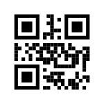       |
| `arrow`      |            |
| `circle`     | 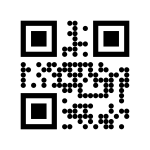         |
| `classic`    |        |
| `heavyround` |  |
| `lightround` |  |
| `sieve`      | 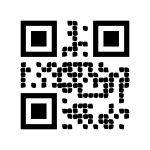           |

## Eyes styles' list
| Name         | Inner eye                                           | Outer eye                                           |
| ------------ | --------------------------------------------------- | --------------------------------------------------- |
| `default`    | 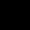       | 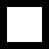       |
| `circle`     | 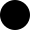         | 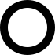         |
| `cushion`    | 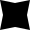       | 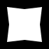       |
| `diamond`    | 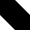       | 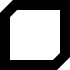       |
| `dots`       | 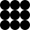             | 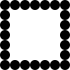             |
| `heavyround` | 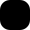 |  |
| `leaf`       | 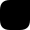             | 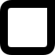             |
| `left_eye`   | 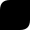     | 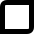     |
| `right_eye`  | 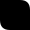   | 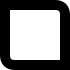   |
| `shield`     | 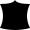         | 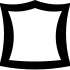         |
| `sieve`      | 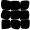           | 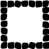           |
| `star`       | 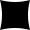             | 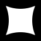             |

**Acknowledgement:** The word *QR Code* is registered trademark of [DENSO WAVE INCORPORATED](http://www.denso-wave.com/en/en/) in Japan and other countries.